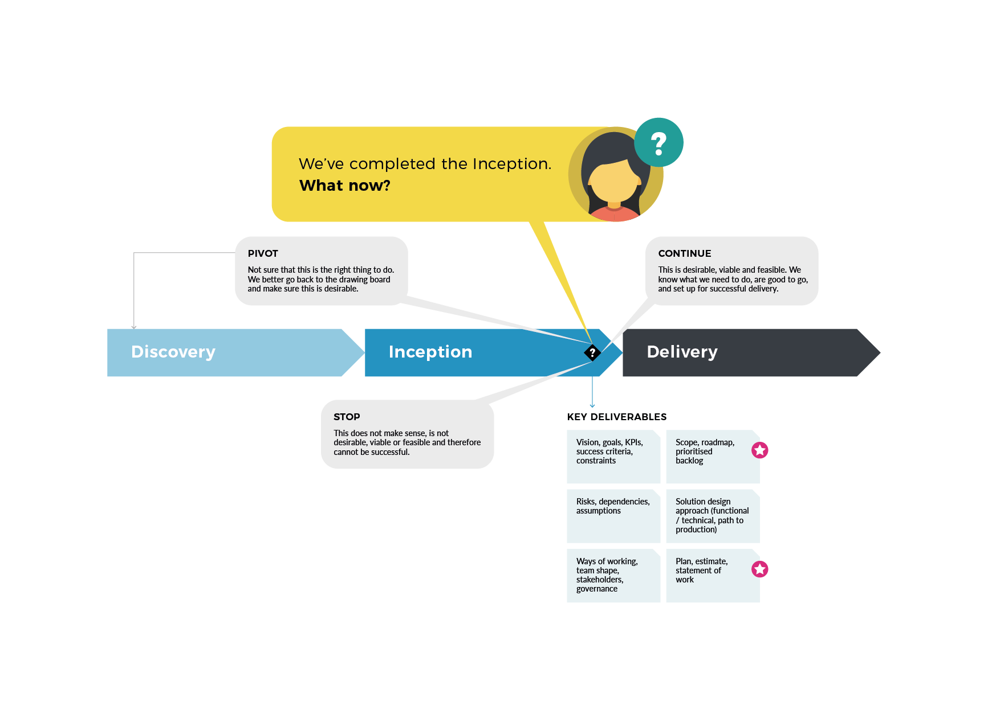

# Inception Complete, What now?

We will see a set of artefacts \(which ones is highly context specific\) that allow us to answer whether to proceed, and if so, how.

From overall ‘project management’ perspective, often the most important deliverable is an expression of scope, a plan or roadmap and associated cost, which we can turn into a statement of work \(marked by the star\). 

This, of course is not the case for all type of Inceptions, for instance, where you incept a new feature for an eisting team, you may be more interested in an assessment of readiness and detailed backlog for the next phase or next steps.

To arrive at these deliverables we will require a number of intermediate artefacts, which, during delivery, provide background and context, and are often the basis for subsequent work. We will discuss this in detail in subsequent chapters.

