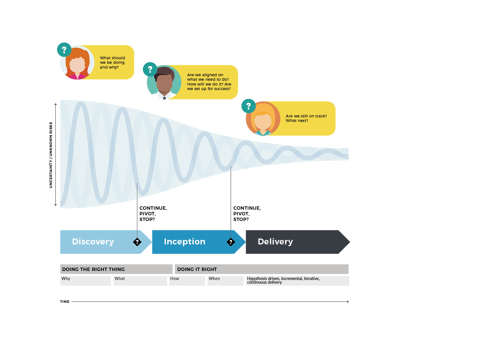

# Inception or Discovery?

## **Finding purpose vs. getting off the ground**

The terms ‘Inception’ and ‘Discovery’ are often used interchangeably. However, we look at it this way: we ‘discover’ the purpose for a product or service, and we ‘incept’ their delivery.

In other words, during a Discovery we focus more strongly on ‘what should we do’ and ‘doing the right thing’. Whereas during an Inception we **validate** and **refine** those aspects and focus on ‘doing it right’ and ‘getting it off the ground’.

Of course, there is considerable overlap between the two and we do revisit user needs in an Inception, but we generally take the initiative’s raison d’être as sound. That is, unless we uncover misalignment or concerns about the validity of a value proposiotin, in which case we may decide to pivot to a Discovery. This is not failure, in fact, recognising this is exactly one reason why we run Inception.

For the purpose of this playbook, we’ll take it that Discovery activities have already happened and we are one step further down the line.

## **Timing**

While we run Inceptions at the start of something new, we may also run one at pivotal points – say, when a new phase kicks off, or there’s a significant shift in context. For example, we’ve run Inceptions as input into a business case, as part of a pitch, to start a client engagement or internal initiative, a new feature or work phase, or as a sense-check and re-alignment activity where overall strategy or circumstances had changed.

## **Inceptions are versatile**

In this playbook, we have a bias towards initiatives with a strong element of software application development. That’s simply because that’s what we do, and where we have run Inceptions successfully. However, it’s worth remembering that Inceptions can be run for many other types of initiative in much the same way as suggested here.

> ### _NB. While this version of the playbook focuses on Inceptions, we may extend it to Discoveries in the future._

## **Inception  vs. Discovery**

We start with an idea, problem or opportunity. We refine this and ensure ‘that we are doing the right thing’ in Discovery, then align on what to do and define how to do it in Inception - ensuring ‘that we are doing it right’. We then create, implement, operate and improve the solution during Delivery.

This approach allows us to minimise risk \(resulting from high degrees of \(early\) uncertainty \(late\) changes.

It is important to remember that this, while being in stages, is in no means ‘waterfall’, as we work iteratively, incrementally and favour breadth over depth.

