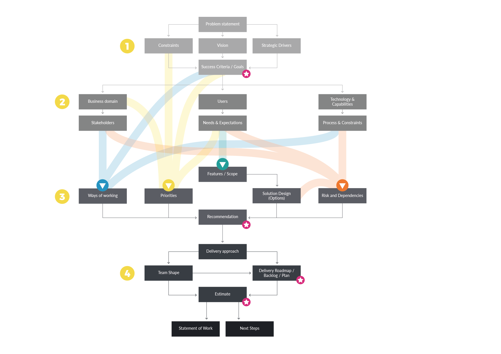

# Design Inception Agenda

As mentioned earlier, a good Agenda has a narrative, a logical flow whereby we conduct activities that give us insight to ultimately fulfil the goals of the Inception:

## **1 - Understand the problem / opportunity**

We start with aligning on what the problem, vision and goals are:

* Why are we doing this? 
* Where do we want to be?

## **2 - Understand context and domain**

We then analyse the to-be state covering people, process and technology:

* Where are we now? 
* What are we dealing with?

## **3- Identify and Define solution options**

We then head into top level to-be solution design: We define scope \(usually feature / epic level overall and story level for the immediate next sprints\) and functional / technical solution design. We agree how to prioritise, identify risks and dependencies, and define ways of working:

* What are potential solution options? 
* How will the solution look like?

## **4 - Identify delivery approach and  plan delivery**

Finally we formulate our recommendation \(of whether / how to proceed\). Where we proceed, we define a delivery approach, team-shape, plan/roadmap and ultimately an estimate, and resulting fro this a statement of work and actionable immediate next steps.

* How do we get there?
* How do we deliver?


Arguably the most important artefacts are those marked with the star. Note, that this diagram shows the logical flow, not all or exact steps or artefacts that one may encounter during an actual Inception. 


