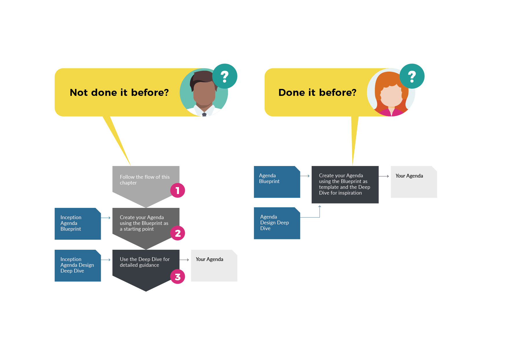

# Design

## **Get your narrative right**

An Inception is like a drama – it has a narrative, a dramatic arch, and very often there is blood, sweat and tears \(and some laughs too, hopefully!\). During **Inception design** we create the **Inception Agenda** which defines the outline of our narrative \( i.e. the activities we want to conduct and the topics we need to address\).

Inception design must be a cross-functional collaborative exercise which can be a single session, or, more likely, goes on for a couple of days or a week dependent on the complexity of the Inception. While design is best done in person we have successfully run them with distributed teams across multiple locations.

No two Inceptions are alike – Inception design is highly contextual, but we believe it can be based on a generic Inception Agenda Blueprint. 

To avoid wasting time reinventing the wheel, we start with our Inception Agenda Blueprint and tailor - as required - following the steps in this chapter.

The duration of Inception Design is usually relative to the duration of the Inception overall, which is itself relative to the size of the challenge in scope. As a rule of thumb, expect to spend:  

* A couple of hours designing and planning a one-day Inception \(say, incepting the development of new features\); 
* A day to design and plan a one week Inception \(for a 3-6 month initiative\);
* A week designing and planning a six-week Inception \(for an initiative taking a year or more\).

Having eventually designed the Agenda, we turn it in the subsequent Inception planning into a detailed **Schedule** which we use to organise and **execute** our Inception.

