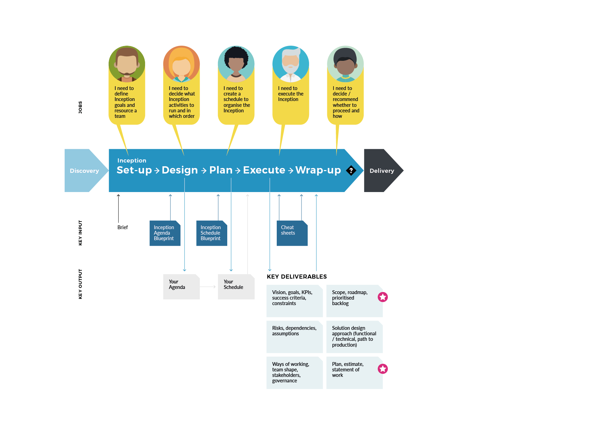

# Overview

## **How it all hangs together**

We run our Inceptions in four stages: **Set-up** where we get ready and set everything in motion, **Design** where we decide what we will do during the Inception, **Plan** when and how we will do it, **Execute** where we conduct the actual activities, and **Wrap-up** where we close the Inception down and facilitate moving forwards. 

We cannot say it often enough: Inceptions are not easy to do well. The nature of the task demands that we need to be able to respond to the unexpected. Good looks like this:

### **Contextual design**

We have a sequence of activities, with a clear narrative leading from the problem we’re asked to address down to the appropriate solution. We provide actionable insights, which the team can use to make relevant strategic decisions: e.g.. ‘Is this the right thing to do’? / ‘What and how will we be doing it?’ / ‘Do we want to do it’? **The Agenda is arguably the most important thing to get right.**

### **Tight but flexible plan**

We sequence our Agenda \(covering the topics we need to address and activities to conduct\) in a **Schedule** that works for the team and stakeholders. A good schedule is sufficiently solid as to provide ‘safety’ and structure while allowing us to react to the unforeseen. The schedule adds a number of supporting ceremonies that frame, top and tail the activities defined in the Agenda to facilitate day to day execution. **A good schedule is vital for successful execution.**

### **Excellence during execution** 

This is a must to facilitate the delivery of the outcomes of the Inception, staying on track while reacting to change as required. 


**In the following part of this playbook we will explain each of these steps in detail, provide Blueprints as templates to start from, Cheatsheets with practical advice, and for the discerning practitioner there is further food for thought in our Deep Dive section.**


## **How it all works**

We **Set-Up** our team, **Design** and **Plan** the Inception, then **Execute** it and finally **Wrap-up**, i.e. act on the insights gained.

This playbook supports these activities  by Blueprints which can be used as templates, Cheat Sheets as quick reminders of the most important things during each activity and Deep Dives that provided detailed guidance on how to design and plan.

  
  

